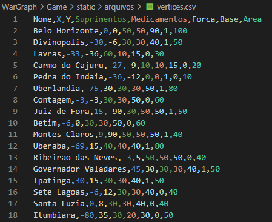
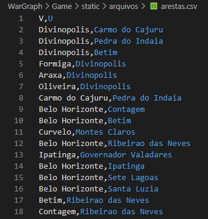
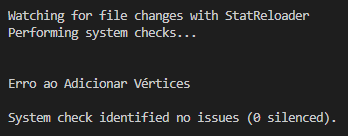
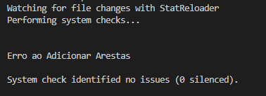
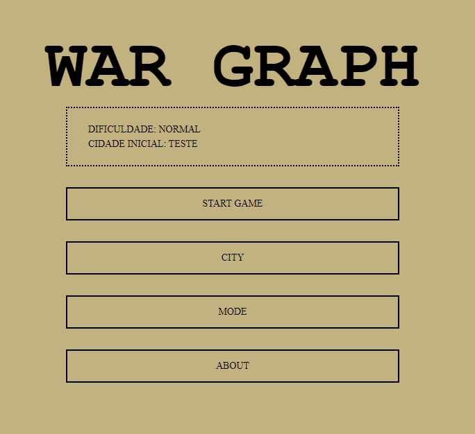
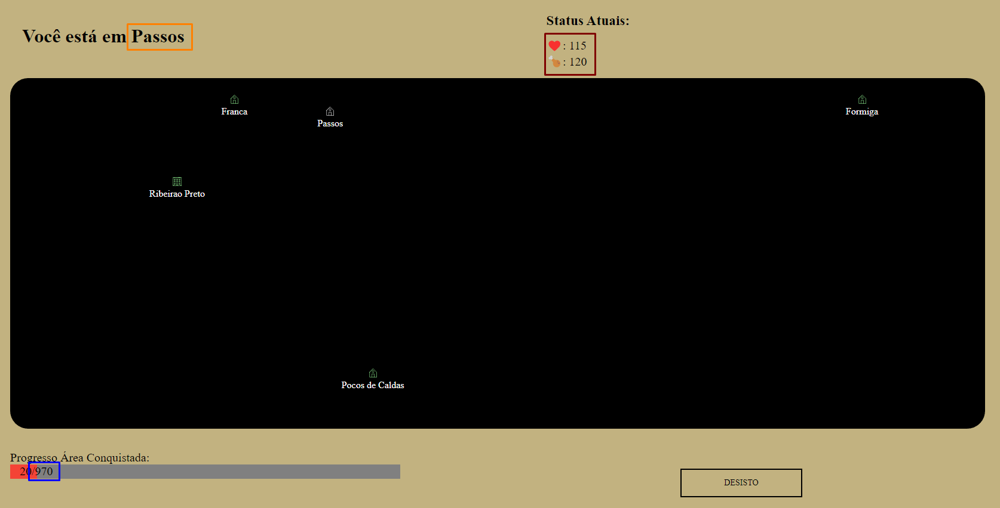
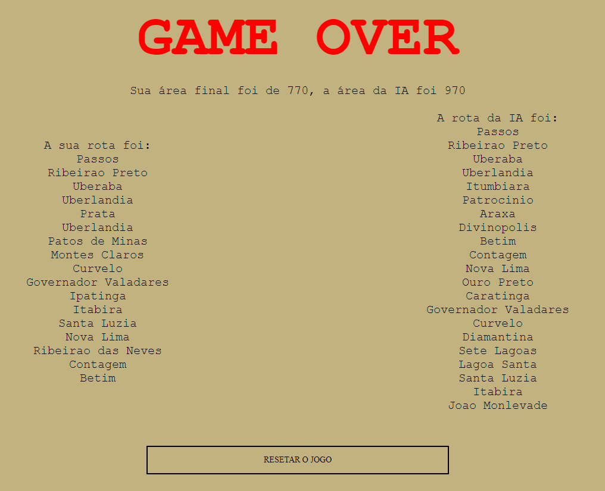

# Representando e Caminhando em Grafos
 

# Objetivo

Neste trabalho o objetivo é aplicar as estruturas em grafos para solucionar um problema real qualquer.

# Problema Abordado

Meu problema é um grafo com arestas ponderadas para um problema mono objetivo, cuja distância é suficiente para obter bons resultados. Existe a possibilidade de ser multi objetivo porém esse não é o foco do seu esforço para esse trabalho. - REESCREVE PEDRO

Este problema foi abordado com a criação de um jogo simples de escolhas.

## Dados do Jogo

O jogo funciona com base em um Grafo não orientado com arestas ponderadas. 

Além dessas o vértice possui a booleana Visitado, variável que é setada como False na criação do Vértice. E a lista de adjacências.

O peso das arestas é determinado pela distância entre os dois vértices, sendo esta a distância de Manhattan, que pode ser vista pela fórmula:

$$ dis = |x_{i} - x_{j}| + |y_{i} - y_{j}| $$

Pela forma que o problema foi proposto, foi decidido que cada Vértice teria sua lista de Adjacentes, visto que o Grafo criado não é denso o suficiente para justificar a matriz de adjacência.

## Background do Jogo

Como todo jogo precisa de um Backgruond, um simples foi criado para este, o background pode ser encontrado na aba About, junto com as Regras para a pessoa jogar. No entanto, para boa prática, colocaremos aqui também:

Você é um general com grandes chances de perder o seu emprego<strike>, ou sua cabeça</strike>. Invadiram o território de seu país e agora você se vê em um único ponto, uma última cidade, sem chance alguma de reaver o território por inteiro sem a decorrência de grandes sacrifícios. Descrentes de sua inteligência e capacidade, seus últimos aliados contratam um grupo de pessoas, que claramente não sabia o que estava fazendo, para criar um algoritmo que tomasse a melhor decisão de qual local atacar em seguida. Você furioso, partiu com seus homens para mostrar que conseguiria tomar uma rota melhor do que a deste algoritmo maldito antes mesmo de ver seu resultado.
 

War Graph é um jogo simples de tomada de decisões criado com o único objetivo de seus criadores utilizarem a estrutura de dados chamada Grafo. Seu objetivo primário neste jogo é conquistar uma área maior ou igual a do algoritmo utilizado (varia de acordo com a dificuldade escolhida).
 

Seus soldados possuem ❤️ (vida) e 🍗 (suprimentos) e gastam ambos para conquistar qualquer ponto que você vá no mapa. Suprimentos também são gastos para visitar bases já conquistadas. O gasto de 🍗 depende da 📏 (distância) percorrida, quanto mais longe, mais suprimentos serão gastos. Já a sua vida é gasta em combate, cada local possui sua própria infantaria de resistência e para ser conquistado é necessário que o seus soldados paguem com sua ❤️. Um adendo, também é possível perder vida por fome, caso você vá para um local tão distante que seus suprimentos acabem no meio da viagem, sua ❤️ começará a ser consumida no lugar.
 

Cada base a ser conquistada possui seu ⚔️ (poderio militar), 🍗 (suprimentos), 🩹 (medicamentos) e 🗺️ (área). Caso sobreviva a viagem e a batalha, após acabar com o ⚔️ adversário, seu exército recebe todos os outros recursos, que são somados a seus 🍗 (suprimentos), ❤️ (vida) e 🗺️ (área) respectivamente.
 

Quando uma cidade nunca foi visitada, seu símbolo no mapa aparecerá com a cor verde, quando já foi visitada, irá aparecer com a cor vermelha, caso essa cidade seja uma base, após visitada ela aparecerá com a cor cor azul, indicando que pode ser revisitada, porém o jogador não ganhará recursos o fazendo. O ponto que você está aparece com uma cor branca.
 

Para vencer basta provar seu valor. Conquiste uma área no mínimo igual ao do algoritmo e mostre que seus aliados não deveriam desistir de você tão facilmente.
 

## Como rodar o Jogo

Para que este jogo rode é necessária a instalação do Python e do Django, o framework utilizado. O Python pode ser encontrado em seu <a href="https://www.python.org">site oficial</a>, a versão utilizada foi a 3.10 apesar de acreditarmos que seja possível utilizar uma versão inferior caso já tenha instalada em sua máquina. Durante a instalação tenha certeza de instalar o pip e de incluir o python no PATH do seu computador.

As versões mais novas de Ptyhon já possuem o pip instalado automaticamente e por isso só é necessário atualizá-los antes de seguir adiante. Para testar se o seu está atualizado, basta abrir a linha de comando do seu computador e digitar `py -m pip install --upgrade pip`, onde o processo de atualização ocorrerá automaticamente se não estiver. Caso no seu caso não esteja nem mesmo instalado, por favor, siga o passo a passo do <a href="https://pip.pypa.io/en/latest/installation/">site do pip</a> para possuir a versão mais atualizada e não encontrar problemas nos passos posteriores.

Com o python instalado, abra a linha de comando do seu computador e instale o django. Para isso, basta digitar na linha de comando `$ python -m pip install Django`, caso tenha instalado o python corretamente com o pip. Se este comando não funcionar, por favor, siga o passo a passo pode ser visto no <a href="https://docs.djangoproject.com/en/4.1/topics/install/#installing-official-release">site oficial do Django</a>.

Com o Django instalado, abra a linha de comando no caminho `...\Representando-e-Caminhando-em-Grafos\WarGraph`, onde se encontram as pastas Game, WarGraph (que tem o mesmo nome da pasta que a engloba), e dois arquivos, o manage.py e um banco de dados (.sqlite3). Para abrir a linha de comando nesta pasta, basta digitar `cmd` na aba de endereços se estiver no windows, ou apertar com o botão direito e abrir o terminal se estiver no Linux. Com a linha de comanda aberta nesta pasta, digite o comando `python manage.py runserver`.

Isso abrirá o servidor no <a href="127.0.0.1:8000">link padrão do Django</a>. Caso deseje rodar em algum IP diferente, digite o comando `python manage.py runserver IP desejado:Porta Desejada`.

## Modificando os arquivos do jogo

Para modificar os arquivos do jogo é necessário alterar os arquivos .csv dentro da pasta `...\Representando-e-Caminhando-em-Grafos\WarGraph\Game\static\arquivos`. Existem dois arquivos, o vertices.csv e o arestas.csv. Como os nomes indicam, eles possuem respectivamente os vértices e as arestas do grafo que será jogado. É possível alterar todos os pontos a própria vontade, seja adicionando arestas ou vértices. Relembrando que não pode se colocar acentos nos nomes das cidades.

Ao alterar qualquer arquivo é necessário rodar novamente o jogo com comando especificado em <a href=#como-rodar-o-jogo>Como rodar o jogo</a>. Ao fazer isso, caso não tenha errado na alteração dos arquivos, não verá mensagens de erro no terminal. Caso erre, poderá aparecer duas mensagens diferentes, ou talvez até ambas em conjunto:

Esses erros ocorrem quando acabou colocando algum vértice com acento ou com dados faltantes, enquanto nas arestas ocorre geralmente quando você quis adicionar alguma aresta onde o vértice dela não existe.

Recomendo que não crie vértices nas mesmas coordenadas que vértices já existentes. Não que vá quebrar o jogo, este funcionará igualmente, pois não foi implementada alguma forma de barrar vértices no mesmo espaço físico que representariam no jogo, mas ficará ruim de jogar dado que a GUI não foi feita para este tipo de problema e acabará colocando as duas cidades no mesmo ponto, impossibilitando que se escolha uma delas. Além disso, é recomendado que se crie arestas para qualquer vértice adicionado. Novamente, o jogo foi preparado para impossibilitar que se jogue em uma cidade sem vizinhos, não chega a ser impossível, mas você só perderia automaticamente, pois isso é claramente o jogador tentando roubar criando uma cidade de vitória instantânea.

Uma limitação real é que o vértice não pode ter o mesmo nome que outro vértice, não ocasionará em erro, mas o vértice que vier depois no arquivo simplesmente não será adicionado ao Grafo.

## Jogando

Após colocar o jogo para rodar, é necessário ir ao <a href="http://127.0.0.1:8000/">link</a> como mencionado anteriormente. Nele, o jogador verá o seguinte menu:

O primeiro botão começará o jogo. O segundo botão levará o jogador a um menu de opções para que escolha qual cidade deseja iniciar o jogo. O terceiro botão leva o jogador a um menu de escolha das dificuldades possíveis para o jogo, sendo elas fácil, normal e difícil, a diferença entre elas para o jogador é meramente a quantidade de área que o jogador precisa conquistar para vencer o jogo. A diferença para o programador será comentada e explicada na sessão de <a href=#-implementação>implementação</a>. O último botão, como mencionado anteriormente, levará a uma tela que explicará o jogo para o jogador.

Ao iniciar o jogo, o jogador será levado para a tela a seguir:

Na área em azul no canto esquerdo inferior está a área que o jogador precisa conquistar para vencer. Idealmente ele não saberia essa área, pelo menos até um certo ponto, pois o general saiu de sua base sem essa informação. Porém, para demonstração dos algoritmos implementados, foi de interesse do criador do código que esse objetivo fosse visível. Na parte superior a esquerda vemos a localização do jogador, no momento, como iniciamos em uma cidade aleatória, acabou que caímos em Passos. No canto superior direito vemos os status atual do jogador, para que este consiga tomar as decisões de acordo com sua situação atual.

No centro vemos o mapa atual. Ribeirão Preto no exemplo é uma base, demonstrado pelo símbolo diferente que é um ponto onde podemos ir e voltar a vontade. Os demais pontos são pontos comuns, que só podem ser visitados uma única vez. Para se ver os dados de cada ponto, basta que se passe o mouse em cima do vértice desejado.

Esses dados não ficam sempre visíveis junto com o nome pois existem regiões com tantas cidades que a informação ficava muito poluída, sendo que mesmo sem eles ela já está bem poluída para algumas cidades.

A partir deste ponto basta o jogador ir clicando nas cidades que deseja ir, tomando sempre a rota que desejar.

Ao finalizar, o jogador será levado para uma tela que o informa se venceu ou perdeu o jogo, além das rotas que ele e o algoritmo tomou. Novamente, esta não seria a opção ideal para um jogo, pois estamos deliberadamente contando ao jogador qual caminho ele precisa fazer para vencer, porém, para o propósito do trabalho e do grafo, acaba sendo necessário demonstrar tais caminhos.

# Implementação

Toda a implementação do jogo foi feita no aplicativo Game e por isso seus códigos estão armazenados na pasta `...\Representando-e-Caminhando-em-Grafos\WarGraph\Game`. Vários `.py` desta pasta não foram utilizados e são mantidos por serem parte da base do Django, sendo melhor não apagá-los. Alguns não foram utilizados por não serem necessários, outros pelo pedido do professor de ser capaz de modificar os dados de entrada, o que não seria possível (de maneira simples) ao utilizar por exemplo o `models.py` ou o `admin.py`.

## Classes (classes.py)

O programa trabalha com três classes principais. O Personagem, o Grafo e o Vértice. Existiu uma quarta classe para auxiliar o BFS, mas como o BFS foi descartado durante a implementação, sua classe não está sendo utilizada no momento. Ela está presente no código final pelo menos motivo que qualquer outro código que não foi apagado, o autor acha que vai continuar programando o jogo no futuro e não sabe o que poderá reutilizar.

### Personagem

A classe personagem é utilizada tanto pelo jogador constantemente, onde os status que são vistos por ele sempre são os de seu personagem, como pelos algoritmos que determinam a dificuldade. Esta classe possui as seguintes variáveis (apesar de seus tipos serem definidos aqui, lembre-se que Python que é uma linguagem fracamente tipada, cabe ao programador lembrar de não alterar seus tipos durante as funções que as utilizar/chamar):

* Localização - Uma String que possui a localização atual do personagem
* Suprimentos - Um inteiro positivo que determina a quantidade de suprimentos que o personagem carrega no momento
* Vida - Um inteiro que determina a vida do personagem no momento
* Área - Um inteiro positivo que determina a quantidade de Área que o personagem já conquistou no momento
* Opções - Um inteiro positivo que determina quantas opções existem para o personagem se mover no momento atual - É utilizada de auxiliar para determinar se o jogo já pode acabar ou não
* Caminho - Uma lista de Strings que mostrará o caminho que este personagem já traçou até o momento

Esta classe possui 8 métodos.

#### __init__

O método construtor do Python. Ao se criar um personagem é necessário enviar o local inicial dele e o grafo. Com isso, tanto a localização quanto o Caminho já podem ser atualizados inicialmente. Opções sempre será igual a 0 no começo. A área inicial do personagem será igual a área do vértice que começou. Já seus Suprimentos e Vida são iguais a 100 mais o que existe no vértice que começou.

#### att_local

O método atualizar local, como o nome indica, atualizará a Localização do personagem no momento atual. Junto desta atualização, também é adicionada uma posição a mais na lista Caminho com essa nova Localização.

#### gastar_sup

O método gastar suprimentos, como o nome indica, gastará os suprimentos do personagem no momento atual de acordo com a distância andada. Lembrando que é necessário checar se o personagem possui suprimentos o suficiente para andar aquela distância, e se não possuir, o restante da distância será consumida de sua vida.

#### apos_luta

O método após lutar atualiza a vida do personagem após lutar pela dominância de algum vértice.

#### check_vida

O método checar vida simplesmente retorna True se o personagem estiver vivo (com vida superior a 0), ou False se o personagem estiver morto.

#### conquistando

O método conquitando atualizará a vida, a área e os suprimentos do personagem com base no vértice que acabou de conquistar. Este método foi implementado de forma separada do método att_local pois graças a existência de bases, existem vezes onde o local do personagem será atualizado e não existe a necessidade de se atualizar os outros valores.

#### print_personagem

O método consiste num print com os dados atuais do personagem no momento.

#### copy

O método retornará uma cópia do personagem no momento atual.

### Vértice

A classe vértice possui a maior parte das informações necessárias para que o jogo ocorra. Essas informações são destrinchadas nas seguintes variáveis:

* Nome - Uma String com o nome da cidade/local do vértice (Strings que não contenham pontuação ou acentos)
* X - Um inteiro com a coordenada X do vértice
* Y - Um inteiro com a coordenada Y do vértice
* Suprimentos - Um inteiro positivo com quantos suprimentos se encontram neste vértice
* Medicamentos - Um inteiro positivo com quantos medicamentos se encontram neste vértice 
* Força - Um inteiro positivo que determina a força do exército que se encontra neste vértice
* Base - Uma booleana que determina se este Vértice é uma base ou não
* Área - Um inteiro positivo que determina a área que este vértice contém
* Visitado - Uma booleana que determina se este Vértice já foi visitado ou não
* Vizinhos - Uma lista de Strings que contém os nomes dos Vizinhos deste vértice

Esta classe possui 5 métodos.

#### __init__

Método principal do Vértice, onde Nome, X, Y, Suprimentos, Medicamentos, Força, Base e Área são recebidos como parâmetro da leitura de arquivos. Visitado é setado como False, pois é impossível um Vértice ter sido visitado em sua criação. E é criada uma lista vazia de Vizinhos.

#### add_vizinho

Método onde o Vértice recebe o nome de um novo vizinho, checa se este já não se apresenta em sua lista de Vizinhos e o adiciona se não estiver.

#### att_sup

Atualiza suprimentos do vértice para 0.

#### att_med

Atualiza medicamentos do vértice para 0.

#### att_vis

Atualiza a variável visitado para True.

### Grafo

O Grafo em si, por ser um grafo com lista de adjacentes, acaba se tornando um grafo onde sua única variável é um dicionário de Vértices, onde o nome do Vértice é a chave para acessar o Vértice.

Esta classe possui 9 métodos

#### __init__

Ao ser iniciado, o grafo só possui um dicionário vazio de nome Vértices.

#### add_vertice

Neste método um vértice é enviado ao grafo para ser adicionado, caso este vértice não esteja presente, ele é adicionado ao dicionário.

#### add_edge

Neste método o Grafo recebe o nome dos dois vértices que possuem uma aresta entre eles e simplesmente chama o método add_vizinho de cada um deles.

#### copy

Neste método é retornado um grafo identico ao atual.

#### print_graph

Neste método são mostrados os nomes de todos os vértices, juntos da informação de se eles foram visitados e quais são seus vizinhos.

#### randomVertice

Neste método é retornado um vértice aleatório entre os Vértices presentes no grafo no momento.

#### visitados

Neste método é retornada uma lista de vértices que já foram visitados no Grafo.

#### cidades

Neste método é retornada uma lista em ordem alfabética de todos os vértices que existem no Grafo.

#### reset

Neste método o Grafo é resetado, para isso todos seus vértices são excluídos e o processo de colheita dos vértices ocorre novamente dos arquivos.

## Importação (arquivos.py)

O arquivos.py possui uma única função que é a de colher dados dos arquivos .csv e retorná-los para o usuário como um Grafo.

Para fazer isso, a primeira etapa é a criação de um objeto da classe Grafo, após isso, começa a ler linha a linha do arquivo de vértices, onde ao fazer isso chama pela função de adicionar Vértice ao grafo. Após a leitura completa dos vértices, é feita a leitura das arestas. 

A validação de leitura de vértices e de leitura de arestas são feitas de forma separada para que fique mais fácil de visualizar qual arquivo está ocasionando em algum erro indesejado.

## Dificuldades (graph.py)

O jogo funciona com três dificuldades, sendo elas as dificuldades Fácil, Normal e Difícil. O objetivo dessas dificuldades é que um algoritmo um pouco mais complexo fosse executado para que a área final obtida fosse maior. Abaixo falarei qual foi a lógica usada para cada uma delas e o que poderia ser feito para melhorar ainda mais a dificuldade.

Como dito no <a href="#problema-abordado">tópico Problema Abordado</a> o problema poderia ser tratado como multiobjetivo, no entanto neste trabalho foram utilizados algoritmos que se importam meramente com um objetivo, o de maximizar a área.

### Fácil

No modo Fácil o jogador jogará com o algoritmo Guloso mais simples possível, onde será checado qual o vizinho (possível de ser visitado) que possui a maior área de todas e tentará ir para este ponto, independente da quantidade de vida, suprimentos, exército inimigo, ou qualquer outra coisa. Retornando assim a área final obtida pelo guloso e qual foi a rota que esse guloso fez.

### Normal

No modo Normal o jogador continuará jogando contra um algoritmo guloso bem simples, porém este não checará meramente qual o de maior área entre os vizinhos. Ele checará também se o jogador possui uma quantidade de vida maior do que o exército inimigo que será combatido, indo para a maior área que esta condição é atendida. Retornando assim a área final obtida pelo guloso e qual foi a rota que esse guloso fez.

### Difícil

No modo Difícil é realizada uma heurística bem simples. Ela começa pegando o resultado da dificuldade Normal e tentará trabalhar em cima dela para melhorá-la. Para isso são adicionados a rota todos os vértices do Grafo que não foram visitados no modo Normal.

A partir deste ponto, uma repetição começa a ser realizada, onde se troca o item visitado i pelo item visitado j. Sendo que i começa do segundo ponto da rota (pois o primeiro é imutável dado que é a localização inicial do jogador) indo até o penúltimo ponto, e j começa do terceiro ponto da rota indo até o último. Durante esta repetição é realizado o cálculo de se a rota nova obtida é melhor que a que voltou do modo Normal ou não.

Para essa avaliação é realizada a lógica simples de se começar na posição inicial do vetor e tentar visitar a posição seguinte, se não puder, tentar visitar a próxima, pois como foram realizadas trocas, não temos a certeza de que o ponto trocado é vizinho dos seus adjacentes no vetor, sendo sempre necessário checar se é ou não vizinho então do ponto atual que se está. O personagem vai andando neste vetor até morrer e quando isso ocorrer é verificada se a área que ele conseguiu é maior ou não do que a área que o modo Normal conseguiu.

Caso a área da troca seja maior, esta nova rota é salva, e o loop das trocas recomeça do começo do vetor. Ao realizar todo o loop de troca sem executar alguma troca melhor, o programa finaliza.

Com os 41 vértices que existem neste grafo colocado neste trabalho, junto das 97 arestas, o modo Difícil apresentou um resultado melhor do que o modo Normal em 26 deles. Este teste pode ser visto rodando a função testarDificuldades existente no graph.py.

### Outras formas de modificar a dificuldade

Seria possível realizar métodos gulosos diferentes no Fácil e no Normal, que ao invés de só olharem a área ganha, olhassem para o ponto vizinho onde o jogador "sofreria" menos, indo para o ponto onde o balanço de exército inimigo e medicamentos fosse próximo, e o quanto o jogador perderá com a distância é compensado pelos suprimentos do local. 

Outra ideia possível seria visitar o vizinho que possui a maior razão área/vida perdida ao visitar o ponto, ao invés de só ir para o ponto com a maior área.

Para o modo Difícil, imaginando que não foram alterados os anteriores, os pontos que são Bases poderiam ser adicionados mais de uma vez (até mesmo os já visitados), pois é possível que durante as trocas tenha alguma situação onde voltando uma vez para uma base acabasse indo para outro vértice depois e melhorasse, mas não é possível somente adicionando todos os pontos não visitados uma vez. 

Outra forma é de executar uma troca dupla, onde poderia ocorrer com algum ponto talvez até mesmo aleatório, ao invés de só testar se uma troca é o suficiente para melhorar o resultado final do algoritmo.

O problema nas alterações do modo Difícil sugeridas é que o jogo poderia ficar muito lento a depender de quantos pontos a mais fossem adicionados para serem comparados, sendo que o modo Difícil atual já é bem mais lento do que os outros dois.

### Função não utilizada mais

O método de caminhamento pensado anteriormente para o Grafo e que seria apresentado neste trabalho seria um BFS modificado. No começo a ideia era de que os gulosos determinariam a área para as três dificuldades e o jogador ao escolher andar veria qual era a % de chance dele vencer a cada movimento. No entanto, para esse cálculo o BFS normal não é o suficiente, pois neste jogo não importa meramente se o ponto A ou B foi visitado como num BFS normal. Além disso, o jogador estando no ponto A, indo para o ponto B e depois para o C é diferente de estar no ponto A, ir para o C e depois para o B, então seria necessário que cada caminhada a um vizinho criasse uma rota diferente e essa fosse sendo atualizada com um próprio personagem atual. Assim ao contrário do BFS padrão que meramente tenta percorrer todo o grafo sem se importar necessariamente com a rota prevista, querendo achar algum vértice específico, no nosso caso não existe um vértice objetivo, o BFS teria que rodar até que não fosse mais possível andar, seja porque o ponto em que chegou não possui vizinhos possíveis de se ir, seja porque o personagem morreu. Com todos os finais diferentes que o BFS achasse, seria calculada a % pela fórmula básica:

$$ chance = {100 * \text{finais com área maior que o objetivo} \over \text{finais totais}} $$

## Funções do Jogo (game.py)

A única função do jogo que existe e ainda é utilizada é o cálculo da distância de Manhattan, que determina o peso das arestas de acordo com o Nome do vértice que o jogador está, o Nome do vértice que o jogador vai e o grafo em si.

Anteriormente existiam duas outras funções, uma para determinar a localização do Jogador, pois este possuiria só as coordenadas e não o nome do local em que estivesse, pois o modo de jogo havia sido imaginado de uma forma um pouco diferente.

Outra função que se tornou obsoleta, foi mais pela necessidade de se fazer as dificuldades. Anteriormente o combate ocorreria ou não dependendo da distância que o jogador percorresse até o outro vértice. Como se havendo um exército inimigo que defende uma cidade vindo do ponto que você está, você gastando mais tempo para chegar lá indica que houvesse mais tempo para que este exército circundasse na cidade e visse o seu exército chegando. No entanto, sendo probabilidade de chance de ocorrer, ficaria difícil de fazer uma dificuldade, dado que o algoritmo poderia acabar combatendo em vértices que o jogador não e vice versa.

## Telas (views.py)

